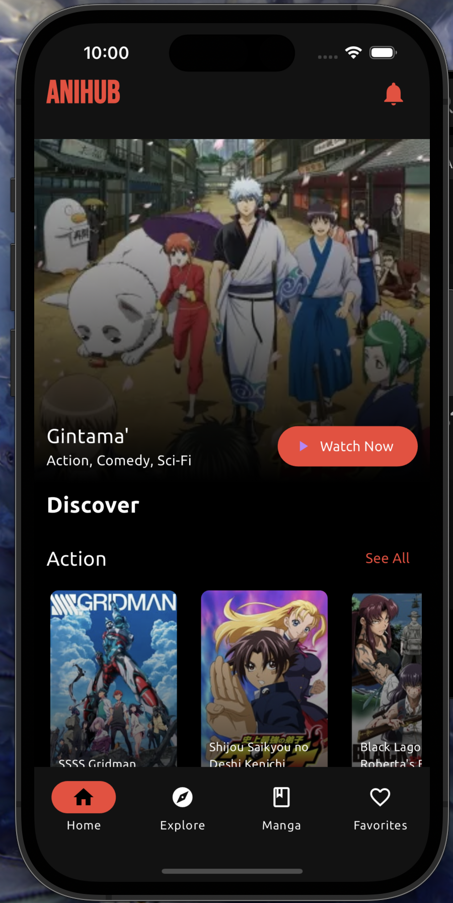
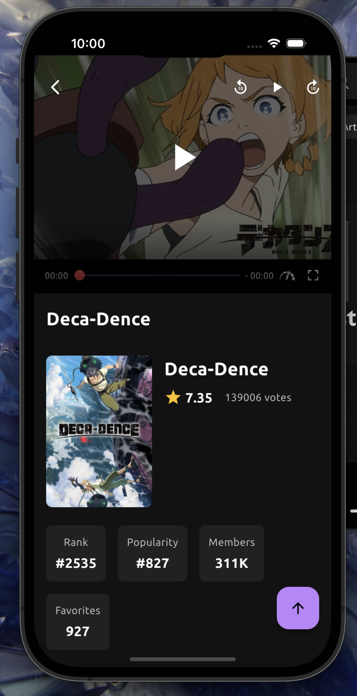
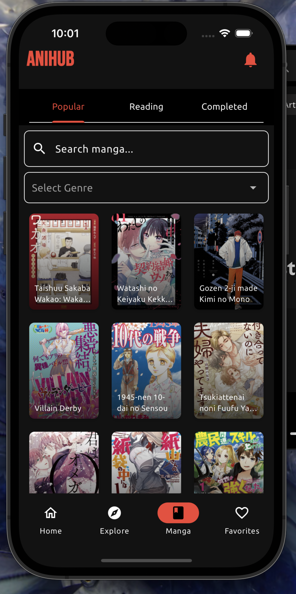

# AniHub - Manga & Anime Reader/Viewer

<p align="center">
  
</p>

AniHub is a feature-rich Flutter application that provides a seamless experience for reading manga and watching anime. Built with modern architecture patterns and best practices, it offers a robust platform for anime and manga enthusiasts.

[](https://flutter.dev/)
[](LICENSE)
[](CONTRIBUTING.md)

## 📱 Features

### 🎯 Core Features

#### Manga Reader
- **Browse & Discovery**
  - Popular manga listing with infinite scroll
  - Genre-based filtering and sorting
  - Advanced search functionality with real-time results
  - Trending and new releases sections

- **Reading Experience**
  - High-quality image rendering
  - Multiple reading modes (Vertical scroll, Page-by-page)
  - Zoom and pan capabilities
  - Chapter progress tracking
  - Offline reading support
  - Custom reading controls
  - Next/Previous chapter navigation
  - Reading history

- **Manga Details**
  - Comprehensive manga information
  - Chapter listings with release dates
  - Author and publication details
  - Genre categorization
  - Rating and popularity metrics
  - Related manga recommendations

#### Anime Features
- **Streaming Capabilities**
  - HD quality video playback
  - Multiple server options
  - Continue watching functionality
  - Episode tracking

- **Content Management**
  - Favorites/Wishlist system
  - Watch history
  - Custom lists creation
  - Progress tracking

### 🎨 UI/UX Features
- Responsive design for all screen sizes
- Dark theme optimized for reading
- Gesture controls
- Custom animations and transitions
- Loading states and error handling
- Pull-to-refresh functionality
- Bottom sheet interactions
- Adaptive layouts

## 🏗️ Technical Architecture

### 📐 Design Pattern
- **Provider Pattern** for state management
- **Repository Pattern** for data handling
- **Service-based Architecture** for API integration
- **SOLID Principles** implementation

### 🔧 Core Technologies
- **Flutter & Dart**
  - Widget composition
  - Custom painters
  - Async programming
  - Stream controllers
  - Route management

- **State Management**
  - Provider for app-wide state
  - ChangeNotifier implementation
  - State persistence

- **Data Persistence**
  - Hive for local storage
  - Cached network images
  - Offline data synchronization

### 🌐 API Integration
1. **Jikan API (MyAnimeList)**
   - Manga/Anime metadata
   - Search functionality
   - Genre listings
   - Ratings and reviews

2. **Consumet API**
   - Manga chapter fetching
   - Image processing
   - Chapter navigation
   - Reading progress

3. **Firebase Services**
   - Analytics tracking
   - Crash reporting
   - Performance monitoring
   - User authentication (planned)

## 📦 Dependencies

## 🚀 Getting Started

### Prerequisites
- Flutter SDK (3.0 or higher)
- Dart SDK (2.17 or higher)
- Android Studio / VS Code
- Git
- Node.js (for Consumet API)

### Installation Steps

1. **Clone the Repository**
   ```bash
   git clone https://github.com/yourusername/anihub.git
   cd anihub
   ```

2. **Install Flutter Dependencies**
   ```bash
   flutter pub get
   ```

3. **Configure Firebase**
   ```bash
   # Install Firebase CLI
   npm install -g firebase-tools
   
   # Login to Firebase
   firebase login
   
   # Initialize Firebase
   firebase init
   ```

4. **Set Up Consumet API**
   ```bash
   # Clone Consumet API
   git clone https://github.com/consumet/api.consumet.org.git
   
   # Install dependencies
   cd api.consumet.org
   npm install
   
   # Start server
   npm start
   ```

5. **Configure Environment Variables**
   ```bash
   cp .env.example .env
   # Edit .env with your configuration
   ```

6. **Run the App**
   ```bash
   flutter run
   ```

## 📁 Project Structure

## 📈 Performance Optimization

- Image caching and compression
- Lazy loading for lists
- Memory management
- Network request optimization
- Widget rebuilding optimization

## 🔐 Security

- API key protection
- Data encryption
- Secure storage
- Input validation
- Error handling

## 🤝 Contributing

Please read [CONTRIBUTING.md](CONTRIBUTING.md) for details on our code of conduct and the process for submitting pull requests.

## 📄 License

This project is licensed under the MIT License - see the [LICENSE](LICENSE) file for details.

## 🐛 Known Issues

- [Issue #1] - Description
- [Issue #2] - Description

## 🗺️ Roadmap


- [ ] Offline mode
- [ ] Custom themes
- [ ] Social features
- [ ] Cross-device sync


## 🙏 Acknowledgments

- [Jikan API](https://jikan.moe/)
- [Consumet API](https://github.com/consumet/api.consumet.org)
- [Flutter Team](https://flutter.dev/)


## 📸 Screenshots

<p float="left">
  
  
  
</p>


## 🌐 Supported Platforms

- Android 5.0+
- iOS 11.0+
- Web (beta)

## 🔄 Version History

### v1.0.0 (Current)
- Initial release
- Basic manga reading
- Anime streaming

### v1.1.0 (Planned)
- User accounts
- Offline mode
- Performance improvements
